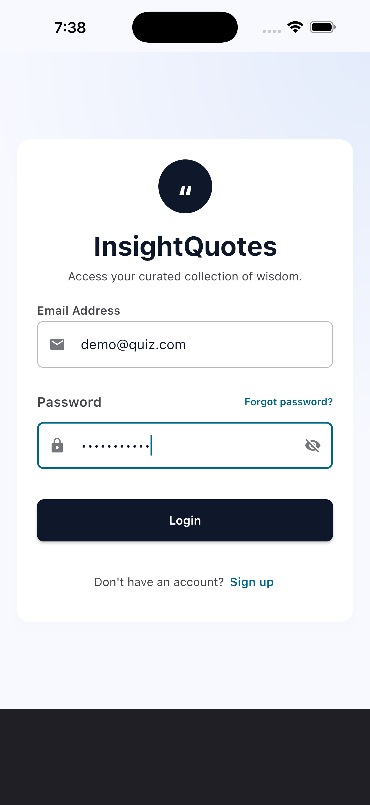
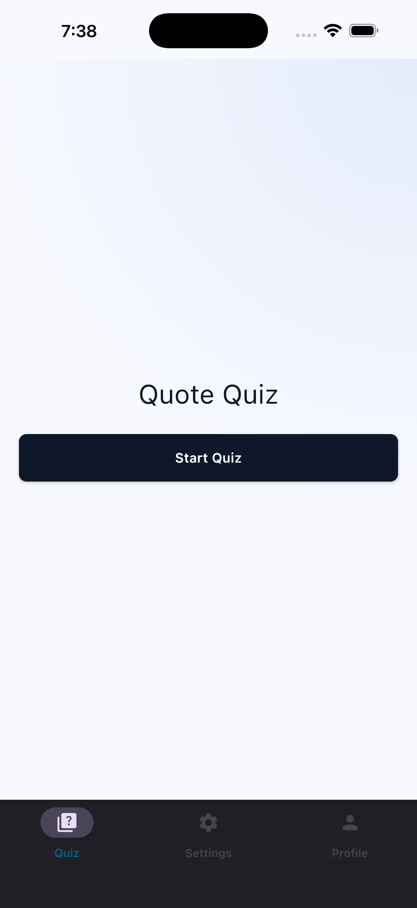
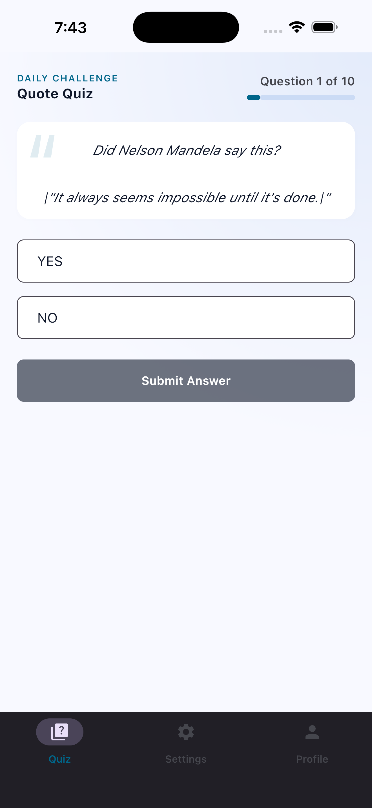
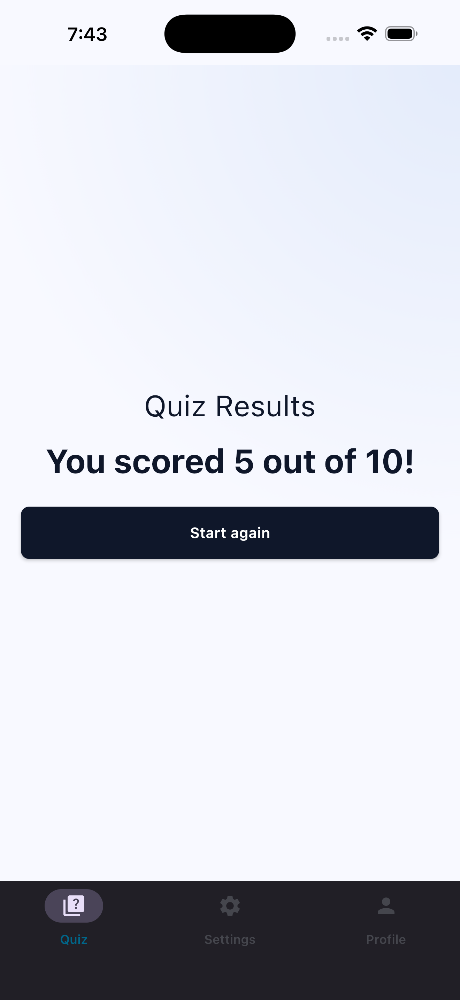
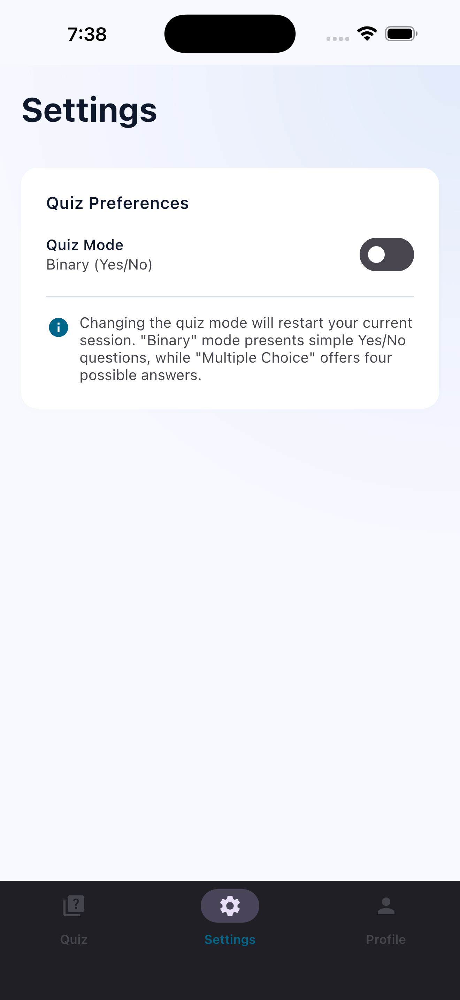
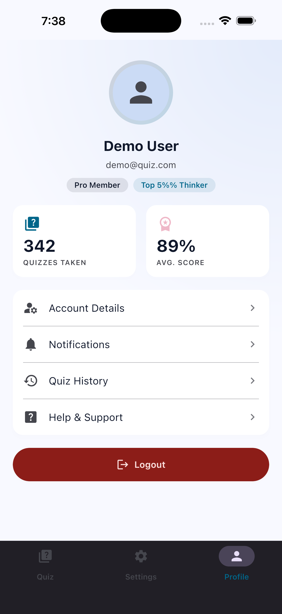

# Famous Quote Quiz

Famous Quote Quiz is a Kotlin Multiplatform (KMP) application that challenges users to identify the
authors of famous quotes. The project demonstrates a modern approach to cross-platform development
using **Compose Multiplatform** for a unified UI across Android, iOS, and Desktop.

## Features

- **Authentication**: Secure login system (Email/Password) to track progress.
- **Quiz Engine**: Interactive quiz with multiple-choice questions about famous quotes.
- **User Profile**: View and manage user information.
- **Settings**: Customizable app preferences.
- **Adaptive UI**: Responsive design that works on mobile and desktop screens using Material 3
  Adaptive Navigation Suite.

## Screenshots

|              Login              |             Home              |             Quiz              |               Results               |
|:-------------------------------:|:-----------------------------:|:-----------------------------:|:-----------------------------------:|
|  |  |  |  |

|               Settings                |               Profile               |
|:-------------------------------------:|:-----------------------------------:|
|  |  |

## Tech Stack

- **Kotlin Multiplatform**: Shared business logic across platforms.
- **Compose Multiplatform**: Shared UI code for Android, iOS, and Desktop (JVM).
- **Koin**: Dependency injection for all modules.
- **Ktor**: Type-safe HTTP client for networking.
- **Kotlinx Serialization**: JSON serialization/deserialization.
- **Multiplatform Settings**: Key-value storage for local persistence.
- **Kermit**: Logging library for KMP.
- **AndroidX Lifecycle**: Shared ViewModels across all platforms.
- **Navigation Compose**: Type-safe navigation for shared UI.

## Supported Platforms

- **Android**: Android 8.0 (API 26) and above.
- **iOS**: iOS 15.0 and above.
- **Desktop**: JVM 11 and above.

## Architecture

The project follows **Clean Architecture** principles, ensuring separation of concerns and
testability. Each feature module is structured into:

1. **Data Layer**: Repositories, DTOs, Mappers, and API clients.
2. **Domain Layer**: Business models, Repository interfaces, and Use Cases.
3. **Presentation Layer**: ViewModels and Composable screens.

## Project Structure

* [`/shared`](./shared): The core module containing shared business logic and Compose UI.
    * `commonMain`: Shared code for all platforms.
    * `androidMain`, `iosMain`, `jvmMain`: Platform-specific implementations.
* [`/androidApp`](./androidApp): Android-specific entry point and configuration.
* [`/iosApp`](./iosApp): iOS-specific entry point (SwiftUI wrapper).
* [`/desktopApp`](./desktopApp): Desktop (JVM) entry point.

## Getting Started

### Prerequisites

- Android Studio (latest stable version)
- Xcode (for iOS development)
- JDK 17 or higher

### Running the apps

- **Android**: Run the `:androidApp` configuration in Android Studio or use:
  ```bash
  ./gradlew :androidApp:installDebug
  ```
- **Desktop**: Run the `:desktopApp` configuration or use:
  ```bash
  ./gradlew :desktopApp:run
  ```
- **iOS**: Open the `iosApp` folder in Xcode or run from Android Studio if the KMP plugin is
  installed.

### API Backend

The app expects a backend running at `http://localhost:8080/api/`. You can update this in
`NetworkingConstants.kt`.

### Demo Credentials

For testing purposes, you can use the following demo account:

- **Email**: `demo@quiz.com`
- **Password**: `password123`

## License

This project is licensed under the MIT License.
